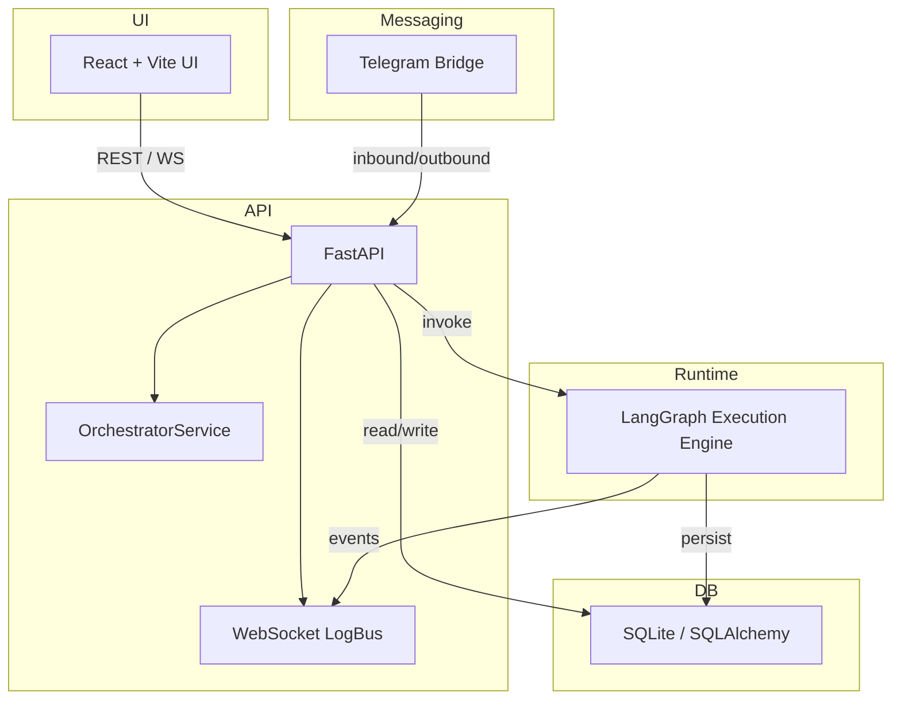

# Agent Orchestration Platform

This repository implements a local-first AI agent orchestration platform where users
create configurable agents, wire them into visual workflows (with conditions and
feedback loops), run workflows on a real runtime, and interact with agents via an
external messaging channel. The project is designed to be runnable locally with a
single command and to be demo-ready for an end-to-end workflow involving at least
two agents and a live human conversation through a messaging channel.

**Goals**
- **Working demo**: run a multi-agent workflow end-to-end and interact with an agent via Telegram.
- **Configurable agents**: personality, tools, schedules, memory, limits, channels.
- **Visual workflow builder**: conditional routing, loops, and templates.
- **Runtime-first**: agents execute real logic on a runtime (no UI-only mocks).
- **Persisted history & monitoring**: message history, logs, token/cost telemetry.


**Repository Layout**
- **`backend/`**: FastAPI app, runtime integration, services, DB models, tests.
- **`frontend/`**: React + Vite web UI (visual workflow builder, agent management, monitoring).
- **`run_local.py`**: convenience runner that bootstraps a local environment and starts services.

**Key Features**
- **Agent CRUD**: name, role, system prompt, model, tools, channels, memory, guardrails.
- **Agent Configuration**: schedules, memory, skills, interaction rules, guardrails (e.g., `max_steps`).
- **Visual Workflow Builder**: nodes, conditional edges, feedback loops, role mapping.
- **Runtime Execution**: agents run on a stateful runtime (graph execution), not a UI mock.
- **Templates**: pre-built workflow templates included.
- **External Channel**: Telegram bridge so humans can chat with an agent.
- **Monitoring**: real-time logs, inter-agent messages, token/cost tracking, WebSocket live feed.
- **Persistence**: message history and execution logs stored in DB and visible in UI.

**Technical Choices & Rationale**
- **Language & Backend**: Python with FastAPI.
	- Rationale: async-native HTTP/WebSocket support, ecosystem for background tasks, fits LangGraph and LLM integrations.
- **Runtime**: LangGraph (graph-based execution).
	- Rationale: explicit node/edge model mirrors the visual workflow builder, supports conditional routing and loop control, auditable execution trace.
- **Frontend**: React + Vite + React Flow.
	- Rationale: rapid UI development, high-quality drag-and-drop flow libraries, fast local dev server.
- **Persistence**: SQLite (default) with SQLAlchemy; swappable to Postgres for production.
	- Rationale: zero-config local persistence during demos; simple migrations to more robust DB.
- **Messaging Channel**: Telegram (bot in polling mode).
	- Rationale: easiest local integration (no public webhook/hosting required), reliable developer experience.
- **LLM Provider**: OpenAI-compatible endpoints (configurable via env). Supports Azure Inference or other OpenAI-compatible endpoints.
	- Rationale: provider-agnostic approach lets you swap providers by changing model strings and keys.

**Architecture Diagram**



**Getting Started (Local)**

Prerequisites
- Python 3.10+ and Node.js 16+ (or installers provided in environment)

Quick start (single command)

1. Copy environment example and set required secrets:

```bash
cp backend/.env.example backend/.env
# Edit backend/.env and set OPENAI_API_KEY (or provider key) and TELEGRAM_BOT_TOKEN
```

2. Start everything locally (one command):

```bash
python run_local.py
```

`run_local.py` will bootstrap a virtual environment, install backend/frontend dependencies if missing, and start backend and frontend services in development mode. If you prefer manual startup, use the manual steps below.

Manual start 
(backend)

```bash
cd backend
python -m venv .venv
.venv\Scripts\activate    # Windows
# or: source .venv/bin/activate  # macOS / Linux
pip install -r requirements.txt
uvicorn app.main:app --reload --port 8000
```

Manual start (frontend)

```bash
cd frontend
npm install
npm run dev
```

Default runtime URLs
- Backend: `http://localhost:8000`
- Frontend: `http://localhost:5173`

**Configuration**
- `backend/.env`: API keys and runtime options (e.g., `OPENAI_API_KEY`, `TELEGRAM_BOT_TOKEN`, `DB_URL`).
- Agents and workflows are manageable from the UI or via the API endpoints.


**Tests**
- Critical tests live in `backend/tests/` and cover agent CRUD and workflow execution.

Run tests:

```bash
cd backend
pytest
```

**How to Add Workflow Templates**
1. Add template JSON or Python definitions in `backend/app/templates.py`.
2. Include `nodes`, `edges`, `roles`, and optional `guardrails`.
3. Restart backend or expose hot-reload for templates in the UI.

**How to Add Messaging Channels**
1. Implement a channel bridge under `backend/app/services/` following the Telegram bridge example.
2. Wire the bridge into the FastAPI application lifespan events in `backend/app/main.py`.
3. Ensure the bridge publishes inbound messages to the orchestrator and that outbound agent responses are posted back through the bridge.

**Scaling & Production Notes**
- Swap SQLite for Postgres and run migrations.
- Replace Telegram polling with webhooks + HTTPS endpoint behind a load balancer for production.
- Move LangGraph runtime to a worker pool or containerized worker autoscaling.
- Add auth, RBAC, and tenant isolation for multi-user deployments.

**Tradeoffs & Alternatives**
- Chosen LangGraph for a direct mapping between visual flows and execution graphs; an alternative like AutoGen could simplify multi-turn orchestration but may not map as directly to node/edge visual semantics.
- Python/FastAPI provides fast iteration for demos; and more flexibility and ease to wire with Langchain based frameworks.
- Telegram polling  to integrate and showcase simple messaging channel demo that minimizes setup friction.

**Extending the Project**
- Add scheduler service for time-based workflow triggers.
- Implement plugin system to register new tool integrations (file I/O, HTTP actions, database reducers).
- Add richer memory stores (vector DB) for long-term memory and retrieval-augmented generation.

**Contributing & Contact**
- Follow standard GitHub workflow: fork, branch, PR with description and demo GIF.

---

If you want, I can also:
- add a small `scripts/` helper to produce the demo GIF automatically;
- add a checklist and sample `.env.example` values; or
- run the test suite and report results locally.

